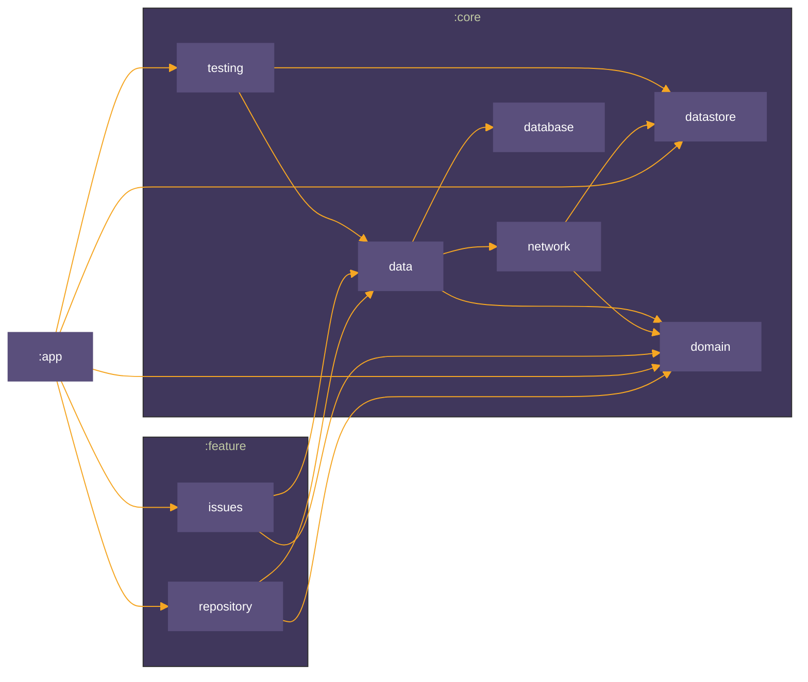

### Module Graph

```mermaid
%%{
  init: {
    'theme': 'base',
    'themeVariables': {"primaryTextColor":"#fff","primaryColor":"#5a4f7c","primaryBorderColor":"#5a4f7c","lineColor":"#f5a623","tertiaryColor":"#40375c","fontSize":"12px"}
  }
}%%

graph LR
  subgraph :core
    :core:testing["testing"]
    :core:data["data"]
    :core:datastore["datastore"]
    :core:domain["domain"]
    :core:network["network"]
    :core:database["database"]
  end
  subgraph :feature
    :feature:issues["issues"]
    :feature:repository["repository"]
  end
  :core:testing --> :core:data
  :core:testing --> :core:datastore
  :core:data --> :core:domain
  :core:data --> :core:network
  :core:data --> :core:database
  :core:network --> :core:datastore
  :core:network --> :core:domain
  :feature:issues --> :core:data
  :feature:issues --> :core:domain
  :app --> :core:testing
  :app --> :feature:repository
  :app --> :feature:issues
  :app --> :core:datastore
  :app --> :core:domain
  :feature:repository --> :core:data
  :feature:repository --> :core:domain
```