## Github Issues App
This is an Android app that uses the [Github GraphQl API](https://docs.github.com/en/graphql) to allow searching for repositories and their issues.
The app implements pagination to efficiently retrieve data in manageable chunks from the Github API. This approach optimizes network usage and enhances performance. Additionally, the app employs local caching, storing fetched data in a local database. This feature enables offline functionality, allowing users to access previously loaded content even without an active internet connection.


### Screenshots
| Idle Screen                                                | Repositories search result        | No repository found                                  |
|--------------------------------------------------------|-------------------------------------------------|--------------------------------------------|
| 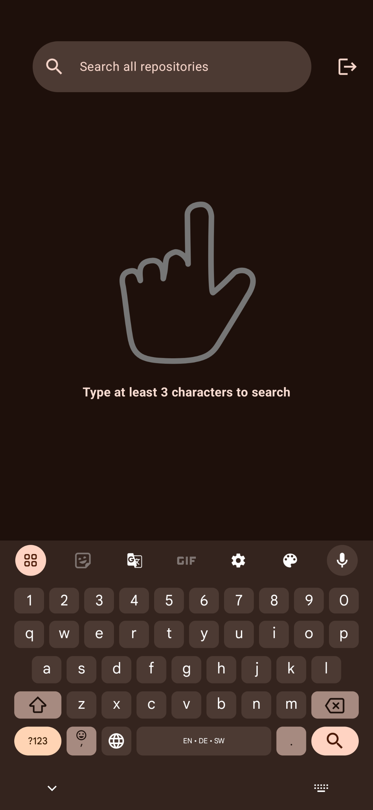 | 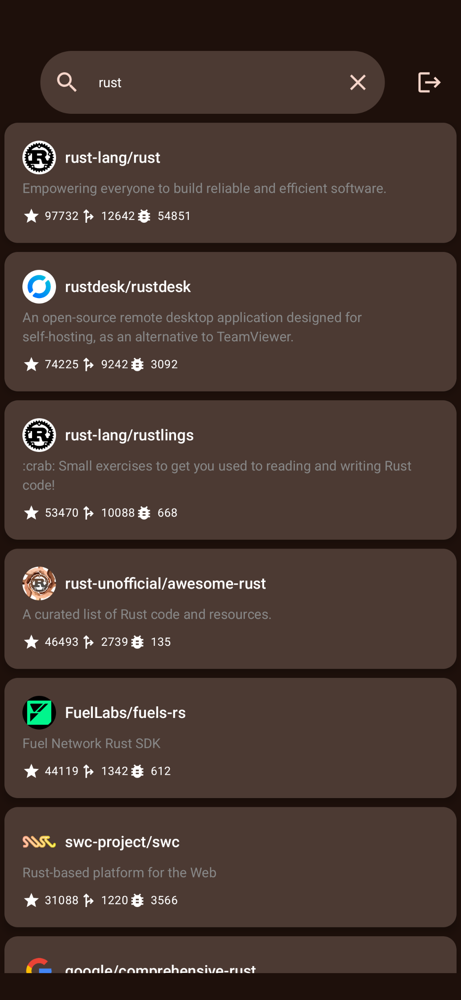 | 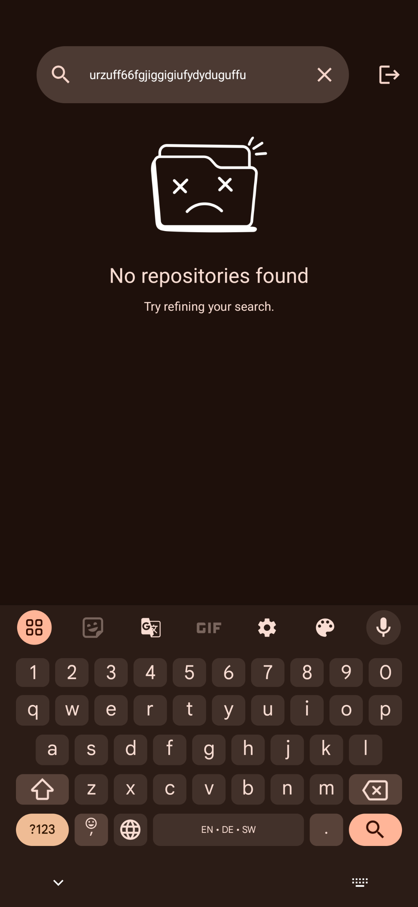 |

| Paged Issues List                                   | Issue List with query                                  | Valid Issue Labels                                  |
|----------------------------------------|-------------------------------------------|-----------------------------------------------|
| 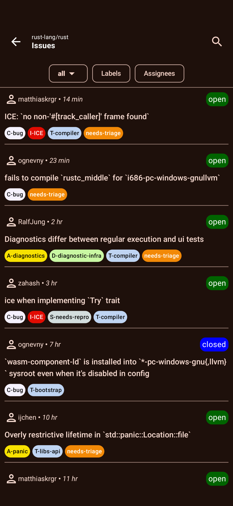 | 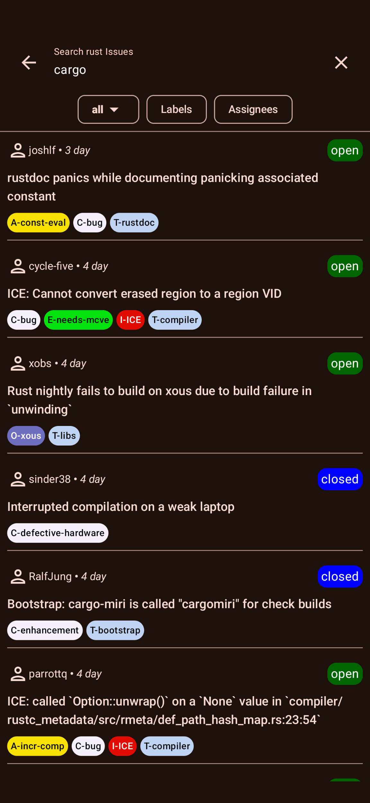 | 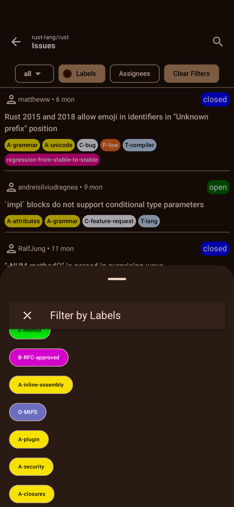 |

*Pre-requisites*
- Built on A.S Koala
- JDK 17
- A Fine [Grained Access token from Github](https://github.com/settings/tokens?type=beta) to download schema from Github GraphQl API.
- Sentry DSN and Auth Token from [Sentry](https://docs.sentry.io/platforms/android/#install)
- GithubClient and Secret key to provide Oauth2 Login from [Github Developers Page](https://github.com/settings/developers)
- Once received place it in the local.properties file as follows:
``` properties
GITHUBCLIENTKEY = your_key
GITHUBSECRET = your_secret
SENTRYDSN = SENTRY_DSN
SENTRYAUTHTOKEN = sentry_auth_token
GITDEVTOKEN = fine_grained_token
```
To Inject the Key when using CI/CD with github actions , add the key to your projects secrets and extract in  to your build workflow:

``` yaml
      - name: Get local.properties from secrets
        run: echo "${{secrets.ProjectSecrets }}" > $GITHUB_WORKSPACE/local.properties
```
## Architecture

This project uses a modularized approach using MVVM with Clean architecture which has the following advantages

- Loose coupling between the code - The code can easily be modified without affecting any or a large part of the app's codebase thus easier to scale the application later on.
- Easier to test code.
- Separation of Concern - Different modules have specific responsibilities making it easier for modification and maintenance.
### Paging 3 Implementation for GitHub Data
This project uses Paging 3 to efficiently load and display paginated data from GitHub. The RemoteMediator is integrated to handle both local database caching and network requests.

  - The app fetches data from GitHub and stores it in a local Room database.
  - When the user reaches the end of the currently displayed data, Paging 3 automatically triggers the RemoteMediator to load more data from GitHub.
  - The system handles refreshing data and loading additional pages seamlessly, ensuring smooth scrolling and minimal load times for the user.
This approach helps maintain a responsive UI while managing data efficiently, even for large datasets.

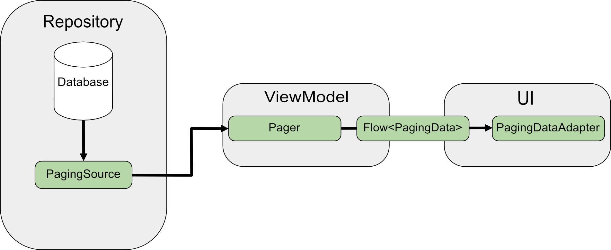

### Modularization Structure

- `core`
    - `data`
      - aggregates the data from the network and local database
    - `network`
        - handles getting data from any server/remote source
    - `database`
        - handles getting cached device data
- `domain`
    - defines the core business logic for reuse
- `app`
    - handles UI entry point of the app and navigation logic.
- `feature`
    - `repository`
        - handles the functionality for searching repositories on github.
    - `issues`
        - handles the functionality for searching and filtering a repository's issues on github.
- `testing`
  - Encompasses the core testing functionality of the project and provides modules for use in End to End tests.
### Module Graph

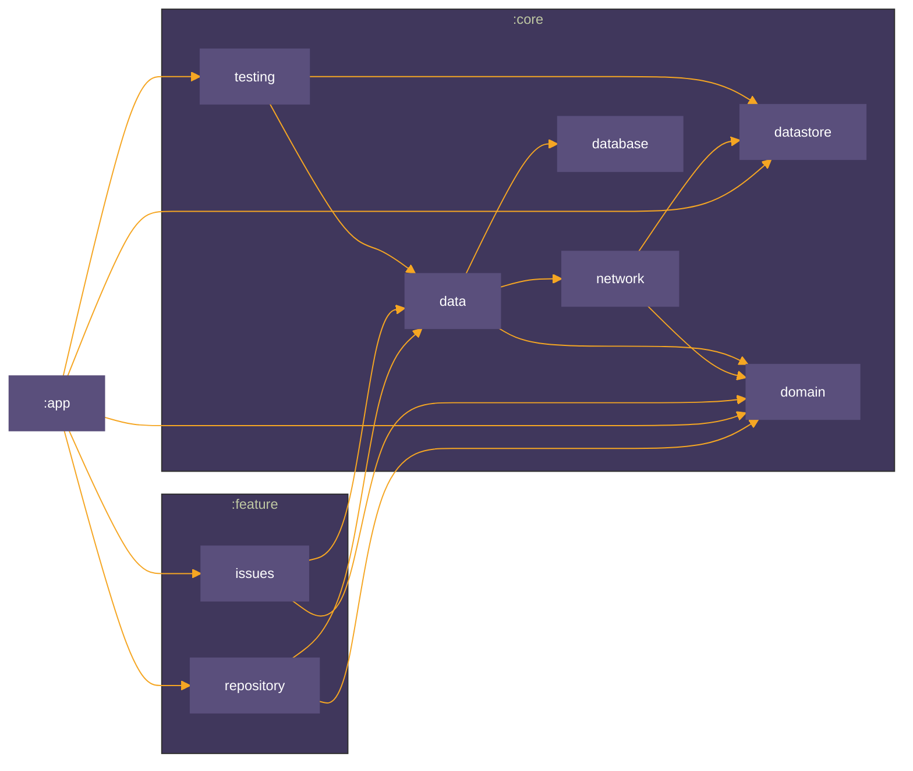
### Testing

The project includes unit tests for all modules, Instrumented tests are ran as unit tests with the use of Roboelectric apart from End to End tests which are run on a physical device declared in the app [androidTest folder](./app/src/androidTest/java/com/devmike/gitissuesmobile/AppE2ETest.kt)

| Description                               | Image                                                |
|-------------------------------------------|------------------------------------------------------|
| **Unit tests for the network layer**      | 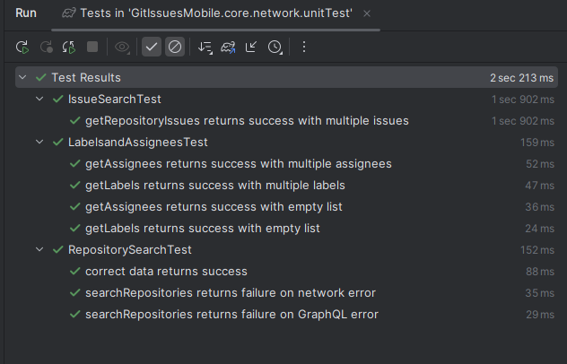   |
| **Unit tests for the database layer**     | 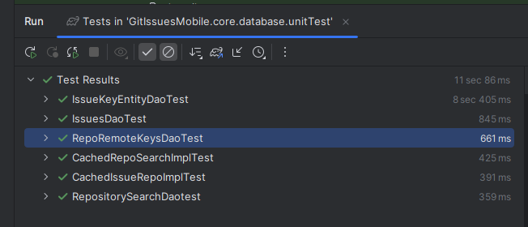      |
| **Unit tests for the data layer**         | 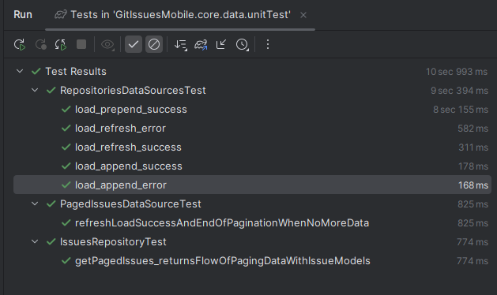     |
| **Unit tests for the issues feature**     | 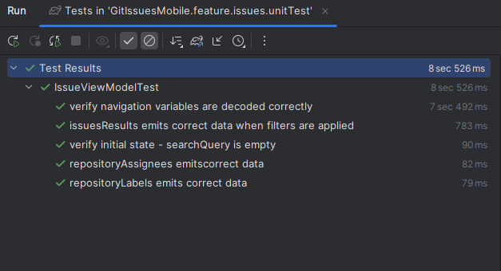 |
| **Unit tests for the repository feature** | 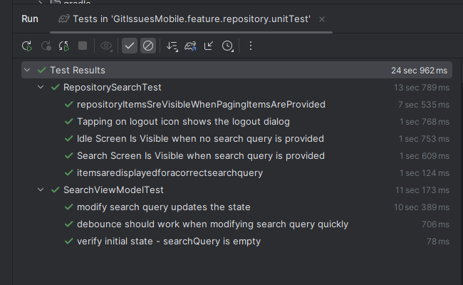  |
| **End to End Tests**                      | 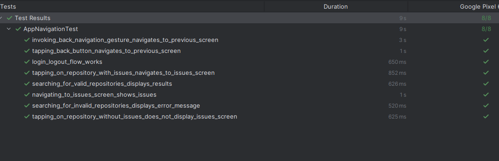           |
| **End to End Tests on a physical device**  | <video  src="docs/video/E2Etests.mp4"/>    |


## TechStack
### Libraries
* Tech-stack
    * [Kotlin](https://kotlinlang.org/) - a modern, cross-platform, statically typed, general-purpose programming language with type inference.
    * [Coroutines](https://kotlinlang.org/docs/reference/coroutines-overview.html) - lightweight threads to perform asynchronous tasks.
    * [Flow](https://kotlinlang.org/docs/reference/coroutines/flow.html) - a stream of data that emits multiple values sequentially.
    * [Dagger Hilt](https://dagger.dev/hilt/) - a dependency injection library for Android built on top of [Dagger](https://dagger.dev/) that reduces the boilerplate of doing manual injection.
    * [Jetpack](https://developer.android.com/jetpack)
        * [Jetpack Compose](https://developer.android.com/jetpack/compose) - A modern toolkit for building native Android UI
        * [Lifecycle](https://developer.android.com/topic/libraries/architecture/lifecycle) - perform actions in response to a change in the lifecycle state.
        * [ViewModel](https://developer.android.com/topic/libraries/architecture/viewmodel) - store and manage UI-related data lifecycle in a conscious manner and survive configuration change.
        * [Room](https://developer.android.com/training/data-storage/room) - An ORM that provides an abstraction layer over SQLite to allow fluent database access.
    * [DataStore](https://developer.android.com/topic/libraries/architecture/datastore) - A data storage solution that allows you to store key-value pairs.
    * [Paging3](https://developer.android.com/topic/libraries/architecture/paging/v3-overview) - A Paging library helps you load and display pages of data from a larger dataset from local storage or over a network
    * [Timber](https://github.com/JakeWharton/timber) - a highly extensible Android logger.
    * [Sentry](https://sentry.io/welcome/) - Application monitoring software with real-time event logging and aggregation platform.
    * [Coil](https://coil-kt.github.io/coil/compose/) - An image loading library for Android backed by Kotlin Coroutines.
    * [Apollo Kotlin](https://www.apollographql.com/docs/kotlin) - A strongly-typed, caching GraphQL client for the JVM, Android, and Kotlin multiplatform.
    
    
* Tests
    * [JUnit](https://junit.org/junit4/) - a simple framework for writing repeatable tests.
    * [MockK](https://github.com/mockk) - mocking library for Kotlin
    * [Truth](https://github.com/agoda-com/Kakao) - A fluent assertions library for Android and Java.
    * [Roboelectric](https://github.com/robolectric/robolectric) - A library that allows you to run your tests on a simulated Android platform.
    *[Turbine](https://github.com/cashapp/turbine) - Turbine is a testing library for kotlinx.coroutines Flow.
* Gradle
    * [Gradle Kotlin DSL](https://docs.gradle.org/current/userguide/kotlin_dsl.html) - An alternative syntax for writing Gradle build scripts using Koltin.
    * [Version Catalogs](https://developer.android.com/build/migrate-to-catalogs) - A scalable way of maintaining dependencies and plugins in a multi-module project.
    * [Convention Plugins](https://docs.gradle.org/current/samples/sample_convention_plugins.html) - A way to encapsulate and reuse common build configuration in Gradle
    * Plugins
        * [Ktlint](https://github.com/JLLeitschuh/ktlint-gradle) - creates convenient tasks in your Gradle project that run ktlint checks or do code auto format.
        * [Spotless](https://github.com/diffplug/spotless) - format Java, groovy, markdown, and license headers using gradle.
* CI/CD
    * [GitHub Actions](https://github.com/features/actions)
    *[Firebase App Distribution](https://firebase.google.com/docs/app-distribution) - A service that allows you to distribute your app to testers and get feedback on your app.


