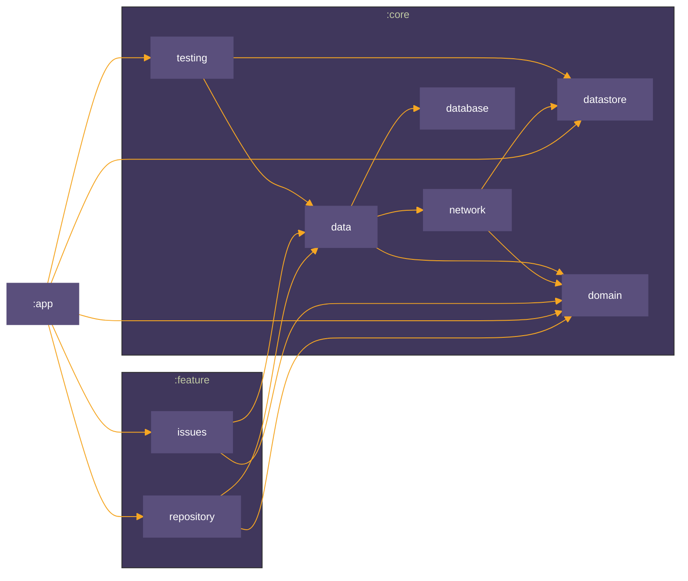

## Github Issues App
This is an Android app that uses the [Github GraphQl API](https://docs.github.com/en/graphql) to allow searching for repositories and their issues.

*Pre-requisites*
- Built on A.S Koala
- JDK 17
- A Fine [Grained Access token from Github](https://github.com/settings/tokens?type=beta) to download schema from Github GraphQl API.
- Sentry DSN and Auth Token
- GithubClient and Secret key to provide Oauth2 Login from [Github Developers Page](https://github.com/settings/developers)
- Once received place it in the local.properties file as follows:
``` properties
GITHUBCLIENTKEY = your_key
GITHUBSECRET = your_secret
SENTRYDSN = SENTRY_DSN
SENTRYAUTHTOKEN = sentry_auth_token
GITDEVTOKEN = fine_grained_token
```
To Inject the Key when using CI/CD with github actions , add the key to your projects secrets and extract in  to your build workflow:

``` yaml
                  - name: Get local.properties from secrets
                    run: echo "${{secrets.LOCAL_PROPERTIES }}" > $GITHUB_WORKSPACE/local.properties
```
## Architecture

This project uses a modularized approach using MVVM with Clean architecture which has the following advantages

- Loose coupling between the code - The code can easily be modified without affecting any or a large part of the app's codebase thus easier to scale the application later on.
- Easier to test code.
- Separation of Concern - Different modules have specific responsibilities making it easier for modification and maintenance.
### Modularization Structure

- `core`
    - `data`
      - aggregates the data from the network and local database
    - `network`
        - handles getting data from any server/remote source
    - `database`
        - handles getting cached device data
- `domain`
    - defines the core business logic for reuse
- `app`
    - handles UI entry point of the app.
- `feature`
    - `repository`
        - handles the functionality for searching repositories on github.
    - `issues`
        - handles the functionality for searching and filtering a repository's issues on github.
- `testing`
  - Encompasses the core testing functionality of the project
### Module Graph


### Testing

The project includes unit tests for all modules, Instrumented tests are ran as unit tests with the use of Roboelectric apart from End to End tests which are run on a physical device declared [in the app androidTest folder](./app/src/androidTest/java/com/devmike/gitissuesmobile/AppE2ETest.kt)